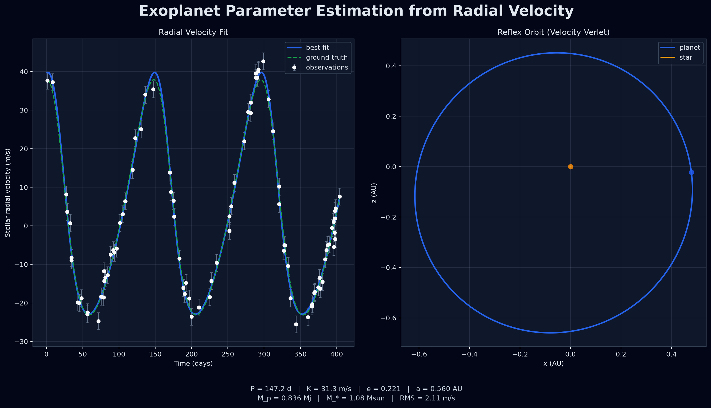

# exoplanet-parameter-estimation-model

A showcase-ready radial-velocity fitting project for estimating single-planet orbital parameters from Doppler observations.



## What it does

This rewrite replaces the original script-based prototype with a small Python package that:

- models stellar radial velocity with a Keplerian single-planet curve
- fits orbital parameters with differential evolution followed by local least-squares polish
- derives an approximate planet mass and semi-major axis from the recovered fit
- renders a two-panel figure with the RV fit and a velocity-Verlet orbit visualization
- generates reproducible synthetic datasets so the project runs without external CSVs

The fitting flow is:

1. generate or load a radial-velocity time series
2. evaluate a Keplerian single-planet model
3. search globally with `scipy.optimize.differential_evolution`
4. polish locally with `scipy.optimize.least_squares`
5. derive a representative planet mass and orbital radius for plotting

## Quickstart

```bash
uv sync
MPLBACKEND=Agg uv run python examples/fit_synthetic.py --save outputs/rv_fit_preview.png
```

That command writes:

- `outputs/rv_fit_preview.png`
- `outputs/synthetic_rv_dataset.csv`

## Archived Observation Data

The recovered observation files now live under `data/archived_observations/`:

- `star0.csv` through `star3.csv`
- `star-masses.csv`

You can fit the recovered `star0` dataset with:

```bash
MPLBACKEND=Agg uv run python examples/fit_archived_star.py --star-index 0 \
  --save outputs/archived_star0_fit.png
```

That command loads Doppler shifts from the archived CSV, converts them into
radial velocity, applies the Keplerian fitter, and saves a real-data summary
figure.

## Using real data

The project also exposes a CSV loader in `src/exoplanet_est/data.py`.
Supported inputs can be either:

- named columns such as `time_days`, `radial_velocity_ms`, and `uncertainty_ms`
- unnamed numeric columns ordered as time, value, optional uncertainty

If your file stores Doppler shift instead of velocity, pass `value_kind="doppler_shift"` to `load_radial_velocity_csv(...)`.

For the archived CSV format, use the packaged helper
`load_archived_star_dataset(...)`, which also converts the legacy time axis
from seconds to days and returns the matching stellar mass.

## Package layout

- `src/exoplanet_est/keplerian.py` - Kepler solver and RV curve
- `src/exoplanet_est/optimize.py` - global + local fitting pipeline
- `src/exoplanet_est/nbody.py` - velocity Verlet orbit integrator
- `src/exoplanet_est/data.py` - CSV loader and synthetic dataset generation
- `src/exoplanet_est/plot.py` - preview figure creation
- `examples/fit_synthetic.py` - end-to-end showcase demo
- `examples/fit_archived_star.py` - archived real-data fitting example
- `docs/exoplanet_showcase_report.tex` - companion LaTeX write-up

## Companion report

A scientific write-up is included at `docs/exoplanet_showcase_report.pdf`
(source: `docs/exoplanet_showcase_report.tex`, bibliography:
`docs/references.bib`). Citations are numbered in order of appearance
(`[1]`, `[2]`, …), which is convenient for an arXiv preprint. The paper
presents the Keplerian RV model, fitting method, synthetic validation, and
observational results with canonical literature citations.

## Notes

The synthetic demo assumes an edge-on system (`sin(i)=1`) so the fitted semi-amplitude can be converted into a single representative planet mass for visualization.
