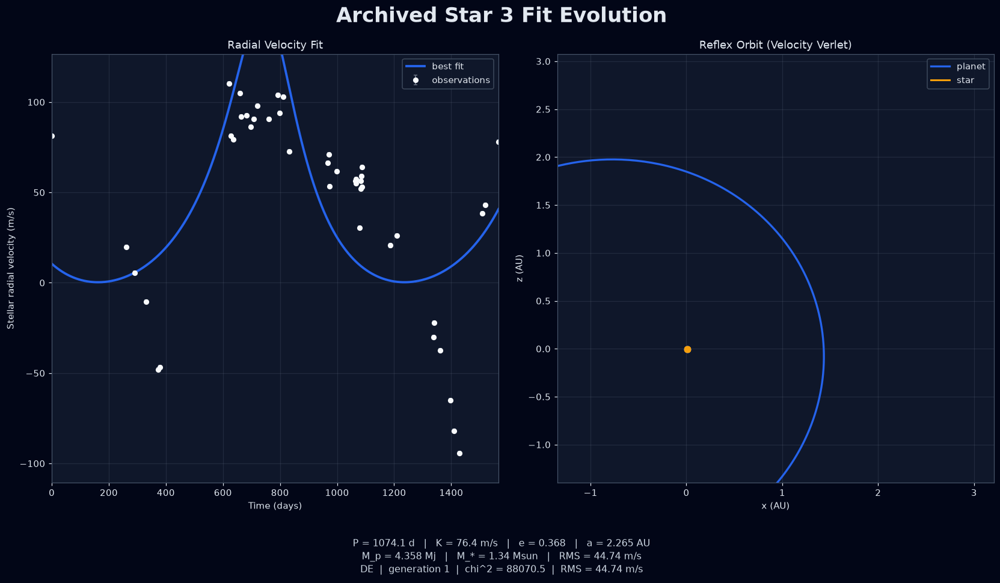

# exoplanet-parameter-estimation-model

A showcase-ready radial-velocity fitting project for estimating single-planet orbital parameters from Doppler observations.



## What it does

This rewrite replaces the original script-based prototype with a small Python package that:

- models stellar radial velocity with a Keplerian single-planet curve
- initializes the period search with a Lomb-Scargle periodogram
- fits orbital parameters with differential evolution followed by local least-squares polish
- derives an approximate planet mass and semi-major axis from the recovered fit
- renders a two-panel figure with the RV fit and a velocity-Verlet orbit visualization
- can export a GIF of the best-so-far model evolving across optimizer generations
- generates reproducible synthetic datasets so the project runs without external CSVs
- ships four public NASA Exoplanet Archive radial-velocity series for real-data demos

The fitting flow is:

1. generate or load a radial-velocity time series
2. estimate a dominant period (for public archive demos)
3. evaluate a Keplerian single-planet model
4. search globally with `scipy.optimize.differential_evolution`
5. polish locally with `scipy.optimize.least_squares`
6. derive a representative planet mass and orbital radius for plotting

## Quickstart

```bash
uv sync
MPLBACKEND=Agg uv run python examples/fit_synthetic.py --save outputs/rv_fit_preview.png
MPLBACKEND=Agg uv run python examples/export_fit_evolution_gif.py \
  --target 51_peg --save docs/51_peg_fit_evolution.gif
```

Those commands write:

- `outputs/rv_fit_preview.png`
- `outputs/synthetic_rv_dataset.csv`
- `docs/51_peg_fit_evolution.gif`

## Public NASA observation data

The observational RV files live under `data/nasa_exoplanet_archive/`:

| Key | Host | Literature source |
| --- | --- | --- |
| `51_peg` | 51 Peg | Marcy et al. 1997 |
| `hd_209458` | HD 209458 | Butler et al. 2006 |
| `70_vir` | 70 Vir | Butler et al. 2006 |
| `hd_3651` | HD 3651 | Butler et al. 2006 |

These are public NASA Exoplanet Archive RVC products. Provenance (archive URLs, bibcodes, instruments, stellar masses) is recorded in `data/nasa_exoplanet_archive/catalog.json`.

Fit any series with:

```bash
MPLBACKEND=Agg uv run python examples/fit_public_star.py --target 51_peg \
  --save outputs/51_peg_fit.png
```

## Using real data

The project also exposes a CSV loader in `src/exoplanet_est/data.py`.
Supported inputs can be either:

- named columns such as `time_days` / `time_jd`, `radial_velocity_ms`, and `uncertainty_ms`
- unnamed numeric columns ordered as time, value, optional uncertainty

If your file stores Doppler shift instead of velocity, pass `value_kind="doppler_shift"` to `load_radial_velocity_csv(...)`.

For the packaged public archive series, use `load_public_target_dataset(...)`.

## Package layout

- `src/exoplanet_est/keplerian.py` - Kepler solver and RV curve
- `src/exoplanet_est/optimize.py` - periodogram bounds, global + local fitting pipeline
- `src/exoplanet_est/nbody.py` - velocity Verlet orbit integrator
- `src/exoplanet_est/data.py` - CSV loader, public-archive catalog helpers, synthetic generation
- `src/exoplanet_est/plot.py` - dark/print-themed figure creation and CSV export
- `examples/fit_synthetic.py` - end-to-end showcase demo
- `examples/fit_public_star.py` - public NASA RVC fitting example
- `examples/export_paper_figures.py` - regenerate paper CSVs / print PDFs
- `examples/export_fit_evolution_gif.py` - animate best-so-far RV/orbit frames over DE generations
- `docs/exoplanet_showcase_report.tex` - companion LaTeX write-up
- `docs/figure_macros.tex` - PGFPlots macros used by the paper
- `docs/51_peg_fit_evolution.gif` - showcase animation used on the README / project card

## Companion report

A scientific write-up is included at `docs/exoplanet_showcase_report.pdf`
(source: `docs/exoplanet_showcase_report.tex`, bibliography:
`docs/references.bib`). Citations are numbered in order of appearance
(`[1]`, `[2]`, …), which is convenient for an arXiv preprint. The paper
presents the Keplerian RV model, fitting method, synthetic validation, and
observational results on named public NASA archive series.

Paper figures are native PGFPlots plots driven by CSV tables under
`docs/figures/plotdata/`. Regenerate everything with:

```bash
MPLBACKEND=Agg uv run python examples/export_paper_figures.py
latexmk -pdf -cd docs/exoplanet_showcase_report.tex
```

That export also writes light-theme vector PDFs in `docs/figures/`. Use `--theme dark` or `--theme print` on the fit examples when saving a single figure.

## Acknowledgment

This research has made use of the NASA Exoplanet Archive, which is operated by the California Institute of Technology, under contract with the National Aeronautics and Space Administration under the Exoplanet Exploration Program.

## Notes

The synthetic demo assumes an edge-on system (`sin(i)=1`) so the fitted semi-amplitude can be converted into a single representative planet mass for visualization.
